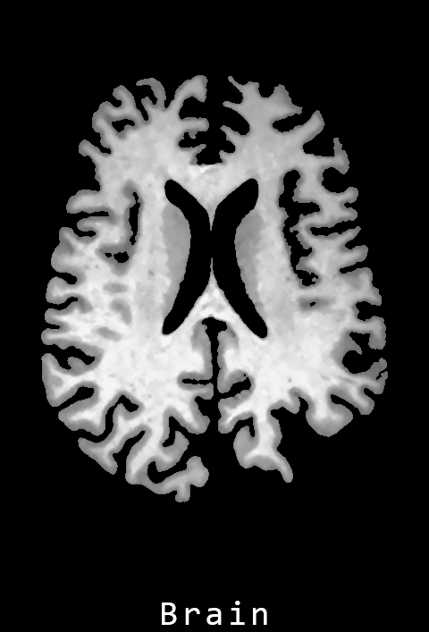
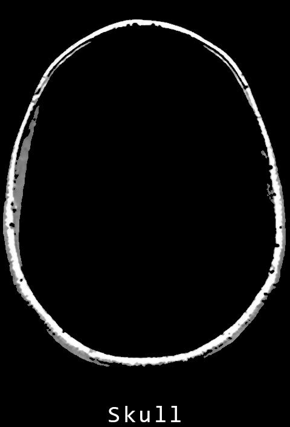
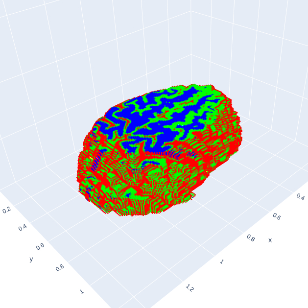

# Brain MRI Analysis

<div>
    
    
    
    
</div>

# Table of contents

-   [Introduction](#introduction)
-   [Code overview](#code-overview)
-   [Getting started](#getting-started)
-   [Contacts](#contacts)

# Introduction

The goal of this project is to develop an algorithm capable of performing the segmentation of a MRI brain dataset. The script specifically analyzes MRI images of the brain in axial orientation, where the slices are acquired horizontally, like taking pictures from top to bottom. Finally, the analyzed images are merged to create a 3D representation of the segmentation.

#### Expected results


#### Obtained results


#### Disclaimer

Aside from the segmentation aspect, the algorithm employed in this project is designed to generalize well even when applied to images not included in the dataset. However, its flexibility is somewhat limited compared to algorithms that utilize more advanced techniques, such as machine learning algorithms. Nonetheless, it can closely resemble real medical segmentations.

# Code overview

This project enables the processing of MRI brain images in various ways, all with the ultimate goal of segmentation. In theory, each brain image should undergo the following process. However, it's worth noting that this sequence is not strictly mandatory. Depending on the characteristics of certain images, some steps may be omitted:

1. **Image adjustment**: in this phase, the initial brain image undergoes adjustment, including denoising, histogram equalization, and setting the background to black. This phase is particularly important for segmentation, as it helps to equalize the image colors.

    ```python
    # Pre-process the image
    adjusted_image = processing.adjust_image(src=img)
    ```

    <p float="left" align="center">
        
        
    </p>

2. **Skull removal**: In this phase, if present, the skull is removed, as segmentation focuses solely on the brain. This is achieved by analyzing each area of the images and retaining the larger ones (above a certain threshold), excluding the largest one, which theoretically corresponds to the skull.

    ```python
    # Remove skull and obtain the brain and skull images
    brain, skull = processing.remove_skull(src=img)
    ```

    <p float="left" align="center">
        
        
    </p>

3. **Brain adjustment**: in this phase, all objects remaining in the image are examined to determine if they could be part of the brain. The analysis involves subtracting both the skull (`skull`) and the brain (`brain`) from the original image (`img`). Any objects intersecting (partially or completely) with the brain are considered as potential components of it.

    ```python
    # Adjust the brain
    brain = processing.adjust_brain(src1=img, src2=brain, src3=skull)
    ```

    <p float="left" align="center">
        
        
    </p>
    
4. **Segmentation and Classification**: In this phase, the final image undergoes segmentation using the K-Means algorithm. Subsequently, a very basic classification approach is employed: each segment's area (colored pixels over black pixels) is utilized to differentiate regions. Typically, the analyzed segments exhibit a relatively consistent number of colored pixels, facilitating classification. This classification process organizes segments based on size, beginning with the smallest:

    * Cerebrospinal fluid
    * Grey matter
    * White matter<br><br>

    ```python
    # Perform segmentation using K-Means
    images = segmentation.kmeans_segmentation(src1=img, src2=brain)
    ```

    <p float="left" align="center">
        
    </p>

4. **3D plot**: In this part, the code involves iterating through a series of images from the result directory (`src`), converting them to PNG format, and plotting them on a 3D graph (`dst`). The resulting 3D plot is displayed interactively and saved as an HTML file. The function allows customization of color (keep the original colors of the image) and image scale (the rescaling of the image).
    
    ```python
    # Create 3D graph
    plotter.create_3d_image(
        src="dataset/results/results/merged_no_skull",
        dst="segmented_brain_colored",
        color=False,
        img_scale=4
    )
    ```

    <p float="left" align="center">
        
        
        
        
        
        
    </p>

> [!NOTE]
> The proposed functions are all publicly accessible. The other functions should be considered private, as they are only support functions used internally.
> The full documentation can be found [here](https://christiansassi.github.io/signal-image-and-video-project/).

# Getting started

1. Initialize the workspace:

    ```bash
    git clone https://github.com/christiansassi/signal-image-and-video-project
    cd signal-image-and-video-project
    ```
2. In the root folder of the repo, unzip [results.zip](dataset/results/results.zip).

   ```bash
   unzip dataset/results/results.zip -d dataset/results/ \
   && rm dataset/results/results.zip \
   && mv dataset/results/results/* dataset/results/ \
   && rmdir dataset/results/results
   ```
   
> [!IMPORTANT]
> Be sure to have "unzip" installed. You can install it using `sudo apt install unzip -y`
> Alternatively, you can use other tools.

3. In the root folder of the repo, unzip [web.zip](web/web.zip).
   
   ```bash
   unzip web/web.zip -d web && rm web/web.zip && mv web/web/* web && rmdir web/web/
   ```
   
4. Install all the python dependencies:

    ```bash
    pip3 install -r requirements.txt
    ```

5. Run [main.py](main.py). This example will segment some of the images within the dataset.

    ```
    python3 main.py
    ```

> [!WARNING]
> The current implementation in `main.py` focuses on a specific range of axial brain images. This excludes the uppermost and bottommost slices due to two challenges. Firstly, these end sections often contain very small portions of the brain, which are less informative for segmentation purposes. Secondly, these areas can be more complex and may require advanced image processing techniques beyond the scope of this project.

# Contacts

Pietro Bologna - [pietro.bologna@studenti.unitn.it](mailto:pietro.bologna@studenti.unitn.it)

Christian Sassi - [christian.sassi@studenti.unitn.it](mailto:christian.sassi@studenti.unitn.it)

<a href="https://www.unitn.it/"></a>
